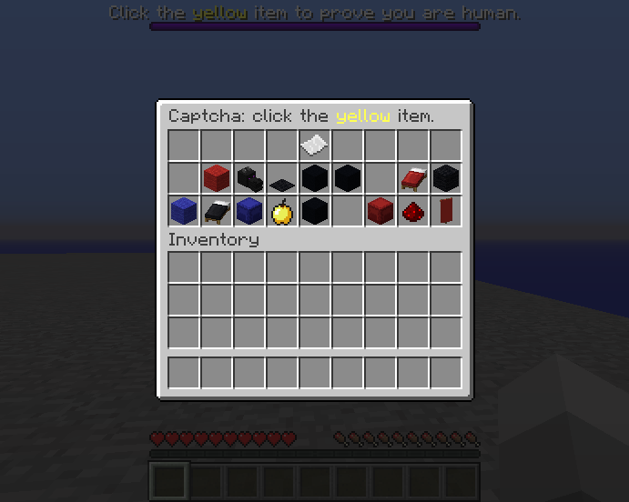
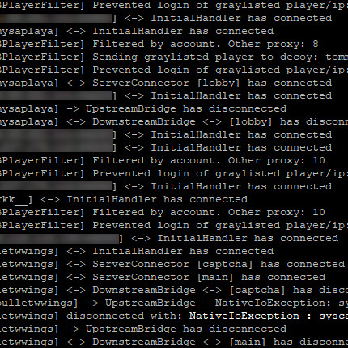

Developed for a Minecraft server to prevent bot accounts connecting en masse to crash the server. Rather than connecting directly to the Minecraft server, players connect to a proxy (which there are a number of; not all players will connect to the same proxy). When a player attempts to join, entries associated with their account and IP address in the SQL database are checked, and they may be flagged as malicious using a number of factors. 

If a connection passes the check, they will connect to the proxy, which then directs them to a captcha puzzle. If they solve the captcha puzzle, this will be recorded to the database, and they will not have to solve a captcha again. The proxy then directs them to the Minecraft server. 

If a connection fails the check, they will either be disconnected or they will be "shadow banned", when the proxy will direct them to a fake Minecraft server insulated from the real Minecraft server.

The plugin successfully stopped the bot problem the server was experiencing.

In this project, I gained experience with the Java programming language and SQL. I also learned a lot about the concept of load balancing which I used to connect players to different proxies when they attempt to join.
